## This repository ✉ contains the **Front End Web Development** 🚀Projects;

> Currently, they are related to learnings from the 🛰 Devsnest Front End Course.
> Projects are kept "Day-Wise", depending on the Take-Home-Assignments given after each session. As a result, the level of projects would also be ascendant- Beginner to Advanced Level.⌛

`You can pick up ✍ an idea for the projects ⚡ to practice here and begin`

## ⤵️List of projects🎓

1. # [**REMIND-QuoteApp** (THA-13)](https://iemprashanttha13.netlify.app).💭
   ***
   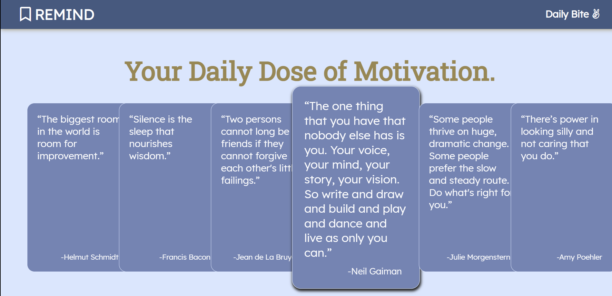
   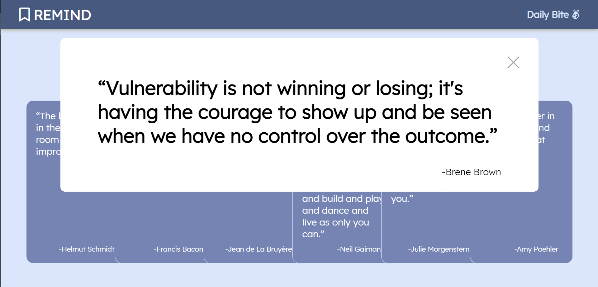
1. # [**GetOnWork-TodoApp** (THA-12)](https://iemprashanttha12.netlify.app).📜
   ***
   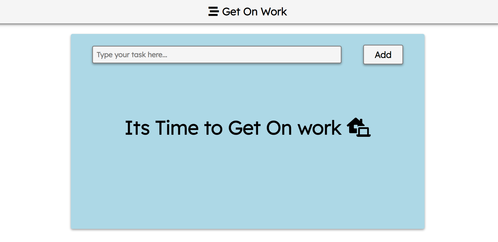
   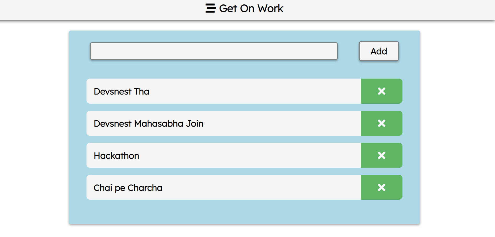
1. # [**Quizza-QuizGame** (THA-11)](https://iemprashanttha11.netlify.app).✅
   ***
   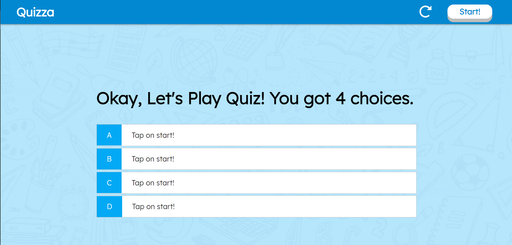
   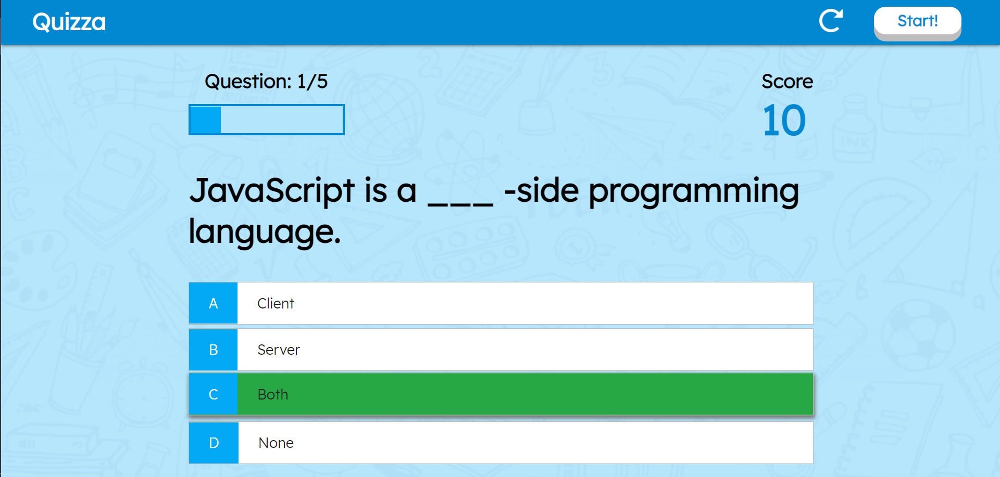
   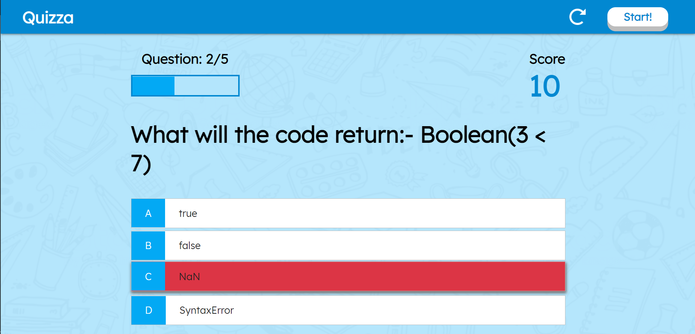
1. # [**Chatai-MemoryCardGame** (THA-10)](https://iemprashanttha10.netlify.app).🃏
   ***
   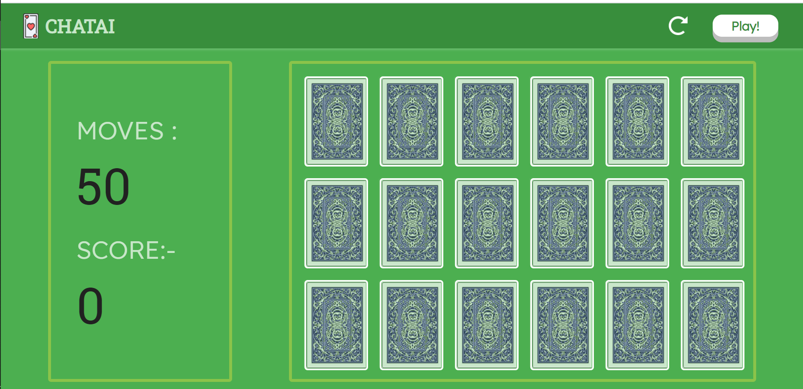
   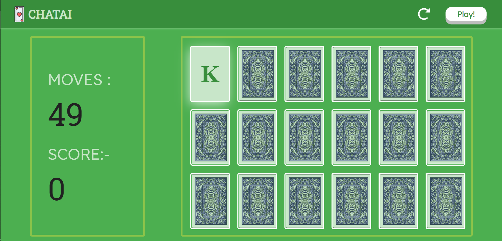
   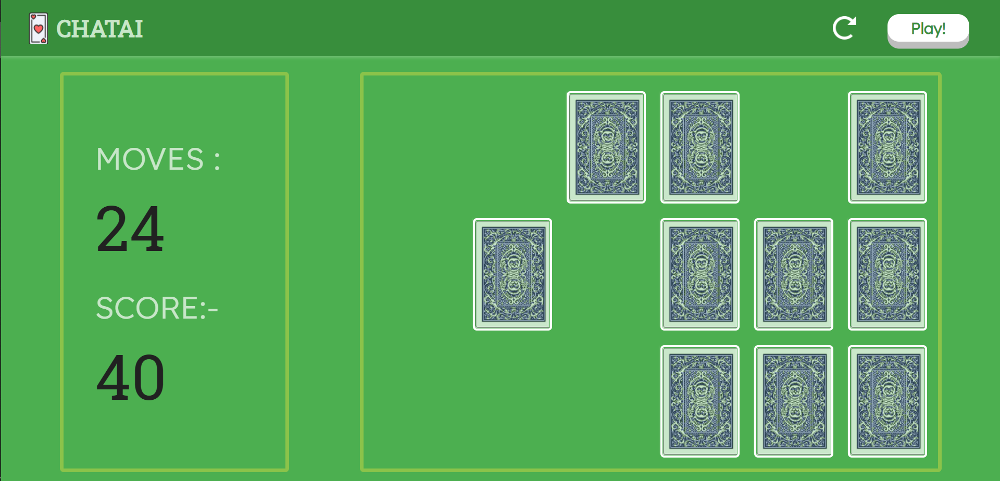
1. # [**Movie Seat Booking Page** (THA-9)](https://iemprashanttha9.netlify.app).🎥
   ***
   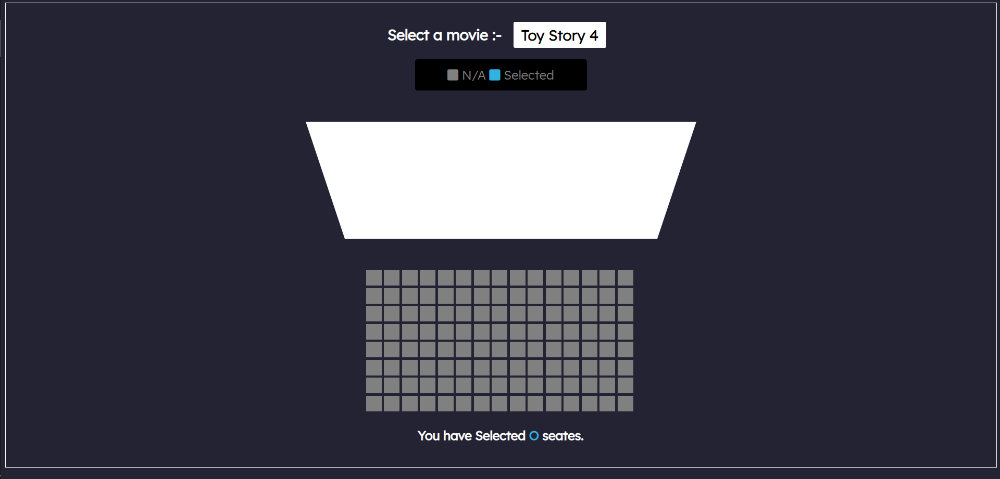
   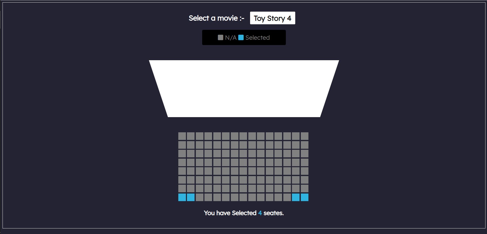
1. # [**100 Days Css Day-46** (THA-8)](https://iemprashanttha8.netlify.app). 🥇
   ***
   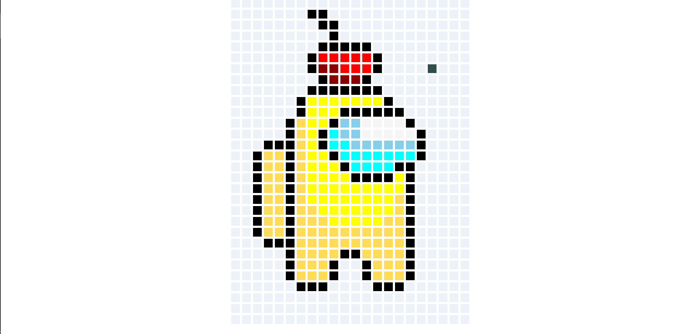
   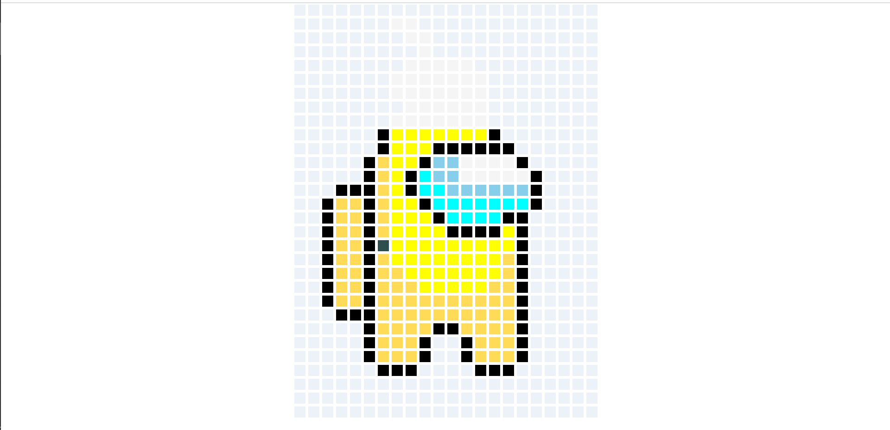
1. # **Array Assignment** (THA-6)📄
   ***

Question-1

> Write a JavaScript function to check whether an `input` is an array or not
> Test Data :
> console.log(is_array('w3resource'));
> console.log(is_array([1, 2, 4, 0]));
> false
> True

```javascript
function is_array(param) {
  const boolean = Array.isArray(param)
  return boolean
}
console.log(is_array('w3resource'))
console.log(is_array([1, 2, 3, 4]))``
```

Question-2

> Write a JavaScript function to clone an array
> Test Data :
> console.log(array_Clone([1, 2, 4, 0]));
> console.log(array_Clone([1, 2, [4, 0]]));
> [1, 2, 4, 0]
> [1, 2, [4, 0]]

```javascript
function array_Clone(array) {
  return [...array]
}
console.log(array_Clone([1, 2, 4, 0]))
console.log(array_Clone([1, 2, [4, 0]]))
```

Question-3

> Write a JavaScript function to get the first element of an array. Passing a parameter 'n' will return the first 'n' elements of the array.
> Test Data :
> console.log(first([7, 9, 0, -2]));
> console.log(first([],3));
> console.log(first([7, 9, 0, -2],3));
> console.log(first([7, 9, 0, -2],6));
> console.log(first([7, 9, 0, -2],-3));
> Expected Output :
> 7
> []
> [7, 9, 0]
> [7, 9, 0, -2]
> []

```javascript
function first(array, n) {
  if (n < 0) {
    return []
  }
  if (n && n >= 0) {
    return array.slice(0, n)
  }
  return array[0]
}
console.log(first([7, 9, 0, -2]))
console.log(first([], 3))
console.log(first([7, 9, 0, -2], 3))
console.log(first([7, 9, 0, -2], 6))
console.log(first([7, 9, 0, -2], -3))
```

Question-4

> Write a simple JavaScript program to join all elements of the following array into a string.
> Sample array : myColor = ["Red", "Green", "White", "Black"];
> Expected Output :
> "Red,Green,White,Black"
> "Red,Green,White,Black"
> "Red+Green+White+Black"

```javascript
function join_Elements(array) {
  return array.join('+')
}
const Colors = ['Red', 'Green', 'White', 'Black']
console.log(join_Elements(myColors))
```

Question-5

> Write a JavaScript program to find the most frequent item of an array
> Sample array : var arr1=[3, 'a', 'a', 'a', 2, 3, 'a', 3, 'a', 2, 4, 9, 3];
> Sample Output : a ( 5 times )

```javascript
function MostFrequent(array) {
  const length = array.length
  const myobject = {}
  let maxValue = 0
  let maxIndex
  for (let i = 0; i < length; i++) {
    if (myobject[array[i]]) {
      myobject[array[i]] = myobject[array[i]] + 1
      if (maxValue < myobject[array[i]]) {
        maxValue = myobject[array[i]]
        maxIndex = i
      }
    } else {
      myobject[array[i]] = 1
    }
  }
  console.log(myobject)
  console.log(maxValue, array[maxIndex])
}
var arr1 = [3, 'a', 'a', 'a', 2, 3, 'a', 3, 'a', 2, 4, 9, 3]
console.log(MostFrequent(arr1))
```

1. # [**Clock:-Using Animations** (THA-4)](https://iemprashanttha4.netlify.app).🕜
   ***
   
1. # [**Resume-Html and Css** (THA-3)](https://iemprashanttha3.netlify.app).📃
   ***
   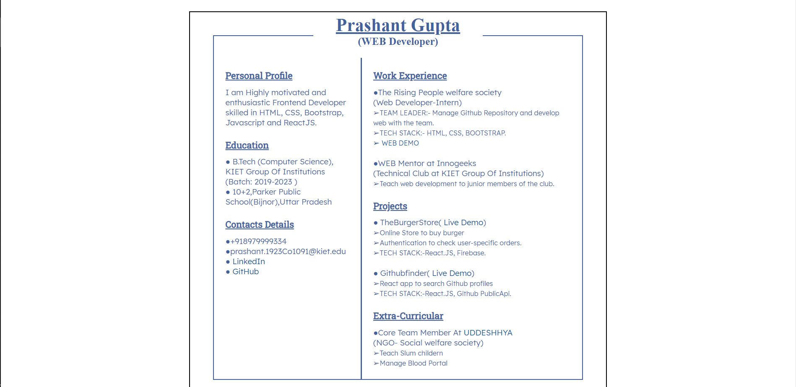
1. # [**Basic Html and Css Letter** (THA-2)](https://iemprashanttha2.netlify.app).💌
   ***
   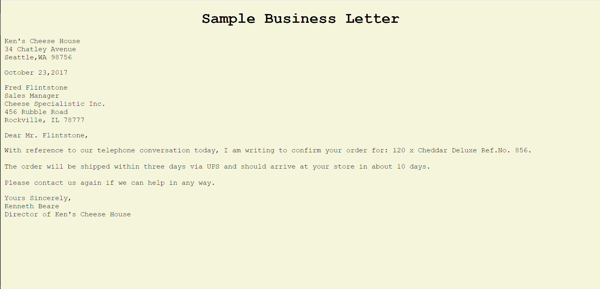
1. # [**Basic Html Letter** (THA-1)](https://iemprashanttha1.netlify.app).💌
   ***
   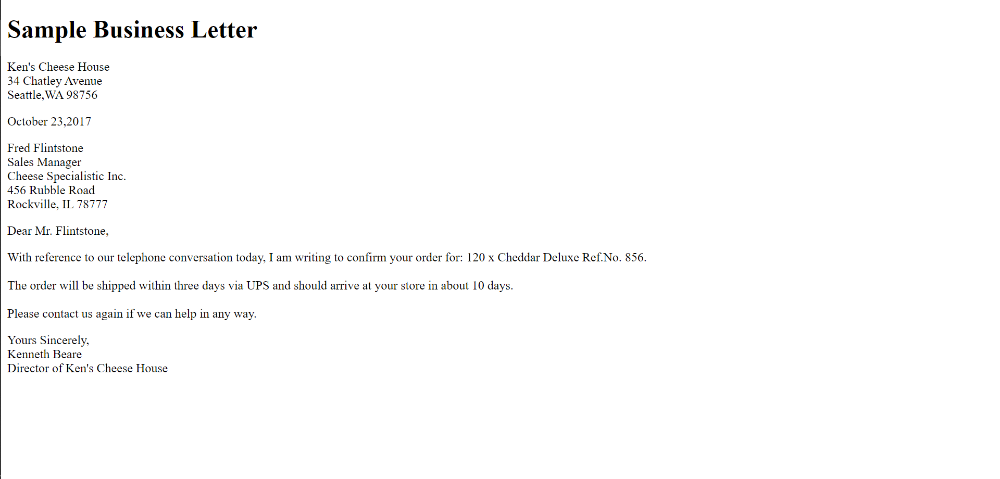
